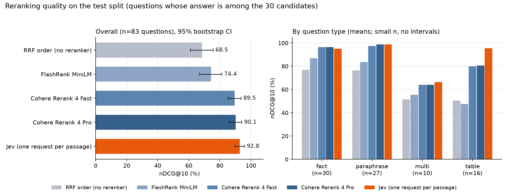

# jevbench: can a typed decision model rerank for RAG?

[](https://github.com/Anvayt24/jev-in-RAG/actions/workflows/ci.yml)
[](LICENSE)


[Jev](https://docs.typesafe.ai/) is a model from TypeSafe AI that answers typed questions (yes/no,
choice, score) with probabilities instead of generating text. This repository tests a practical
question: **used as a reranker in a RAG pipeline, how does Jev compare with the rerankers teams
use today?**

One hybrid-retrieval pipeline produces a frozen list of 30 candidate passages per question. Each
reranker re-orders the same candidates, and the result is scored against labeled evidence in seven
documents: research papers, two NIST standards, a hardware datasheet and financial statements.

## Result



Test split, the 83 answerable questions whose answer is among the 30 candidates:

| reranker | nDCG@10 (%) | first result correct (%) | table lookups, nDCG@10 (n=16) |
|---|---|---|---|
| RRF order (no reranker) | 68.5 | 53.0 | 50.5 |
| FlashRank MiniLM | 74.4 | 61.4 | 47.5 |
| Cohere Rerank 4 Fast | 89.5 | 85.5 | 79.8 |
| Cohere Rerank 4 Pro | 90.1 | 86.7 | 80.6 |
| **Jev, one request per passage** | **92.8** | **91.6** | **95.4** |

- **Jev ranks about as well as the strongest baseline overall, and better on tables.** Its nDCG@10
  is +3.3 points above Cohere Fast (95% CI −0.4 to +7.3) and +2.7 above Cohere Pro (−0.6 to +6.5),
  which is not a clear difference. Against FlashRank the gap is +18.4 (11.7 to 26.0) and is clear.
  The largest gap is on table lookups, 95.4 against about 80 for Cohere, but that is 16 questions
  and should be read as a pattern worth testing, not a finding.
- **Packing the passages into one request works as well and is cheaper.** On the 43 questions where
  both modes ran, one request per query scored 92.1 against 92.9 for one request per passage, at a
  median of about 0.8 s against 1.6 s and $0.0006 against $0.0010 per query. This mode ran on only
  56 of the 107 test questions.
- **Cost and speed.** Per-passage Jev uses about 23k input tokens per query across 30 requests
  (about $0.001 through OpenRouter). Its median latency is 1.5 s when the requests are sent
  concurrently and 18.6 s when sent one by one. Cohere Fast takes 1.1 s; FlashRank takes 2.8 s on a
  CPU.

All tables, intervals and breakdowns are in [results/report_test.md](results/report_test.md). The
method, metric definitions and threats to validity are in [docs/methodology.md](docs/methodology.md).

### What this does not show

- **Jev as an answerability gate** (deciding whether the retrieved passages can answer the question
  at all) is a use the vendor's own cookbooks emphasise, and it is untested here. The gate, a
  run-to-run stability probe and a candidate-order probe are implemented and unit-tested, but they
  were not run because the API credits ran out.
- **Run-to-run stability.** Two identical requests in a smoke test returned 0.75 and 0.76, so Jev
  is not perfectly deterministic. How much that matters for ranking has not been measured.
- **Generality.** One small corpus and 92 answerable test questions, so the intervals are wide. The
  questions were drafted with an LLM assistant and verified mechanically (every gold quote must
  appear verbatim in its document); beyond that the labels have not been independently audited.
- **A mild home advantage.** Jev is asked whether a passage contains the facts needed to answer,
  which matches how the gold labels are defined, while cross-encoders are trained for relevance. A
  relevance-only Jev variant scores 91.0 against 92.8, so the wording is not the whole story.

## What is compared

| id | system |
|---|---|
| `none` | Baseline: the fused order from retrieval, no reranker |
| `flashrank` | FlashRank `ms-marco-MiniLM-L-12-v2`, a small cross-encoder that runs on CPU |
| `cohere` | Cohere Rerank 4 Fast (hosted) |
| `cohere_pro` | Cohere Rerank 4 Pro (hosted) |
| `jev_pair` | Jev `typesafe/jev-1.13` via OpenRouter, one request per (query, passage); the score is P("the passage contains the facts needed to answer") |
| `jev_pack` | Jev with one request per query and one yes/no question per candidate |

```
PDFs -> markdown pages -> chunks (<= 480 tokens)
     -> BM25 + dense (bge-small, FAISS) -> reciprocal rank fusion -> 30 frozen candidates / question
     -> reranker: none | FlashRank | Cohere Rerank 4 (Fast, Pro) | Jev (per passage, packed)
     -> nDCG@10, MRR, Hit@k with bootstrap intervals, split by question type
```

## Reproduce

```bash
uv sync                                    # dependencies into .venv (Python 3.12)
cp .env.example .env                       # then add OPENROUTER_API_KEY and COHERE_API_KEY

uv run python -m jevbench.download_docs    # the 7 source PDFs -> data/raw/
uv run python -m jevbench.ingest           # parse, chunk, embed, index
uv run python -m jevbench.build_eval       # check every gold quote, assign dev/test
uv run python -m jevbench.retrieve         # freeze 30 candidates per question

uv run python -m jevbench.run_rerank --rerankers none flashrank cohere cohere_pro jev_pair --split test
uv run python -m jevbench.evaluate --split test --rerankers none flashrank cohere cohere_pro jev_pair
```

The committed `results/scores/` hold the stored scores, so the report can be rebuilt without any API
key by running only the first four commands and then `evaluate`. An integrity check flags the run if
the regenerated candidates differ from the ones the scores were computed on. Live runs cost about
$0.16 for per-passage Jev over all 162 questions; Cohere's free trial key allows about 10 requests
a minute, so each Cohere model takes roughly 18 minutes.

The experiments that were not run:

```bash
uv run python -m jevbench.run_rerank --rerankers jev_pack                      # packed mode
uv run python -m jevbench.run_rerank --rerankers jev_pair_rerun jev_pack_shuffled --split test
uv run python -m jevbench.gate --rerankers flashrank cohere cohere_pro jev_pair --split test
uv run python -m jevbench.evaluate --split test        # now includes the probes and the gate
```

Development: `uv run pytest`, `uv run ruff check .`, `uv run ruff format --check .` (the same
checks CI runs), and `uv run --group plots python scripts/make_figures.py` to redraw the chart.

## Repository layout

```
src/jevbench/
  download_docs.py   fetch the source PDFs        ingest.py     parse, chunk, embed, index
  retrieve.py        hybrid retrieval + RRF       labels.py     map gold quotes to chunks
  build_eval.py      validate quotes, split       run_rerank.py score candidates (resumable)
  rerankers/         interface, FlashRank, Cohere, Jev        gate.py   answerability gate
  metrics.py         hit@k, MRR, nDCG, bootstrap  evaluate.py  build the markdown report
data/eval/           questions (per-document sources + merged file) and a spot-check sheet
results/             stored scores and generated reports
docs/                methodology and the results chart
scripts/             chart, spot-check sheet, one-call Jev smoke test
tests/               64 tests on a synthetic corpus; no models or network needed
```

## License

MIT, see [LICENSE](LICENSE). The source documents belong to their publishers and are not included.
